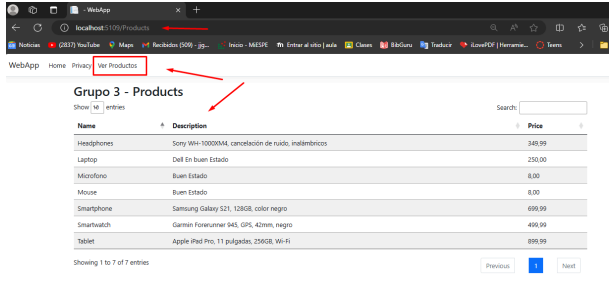
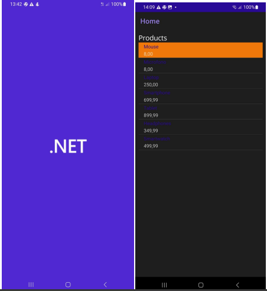

# 🖥️📱 Microservicios OrderProduts - Frontend para Web y Móvil

Este proyecto contiene el frontend para las aplicaciones web y móviles que se comunican con los microservicios del backend disponible en el repositorio [MicroservicesLab_OrderProduct](https://github.com/Jhostyn-2003/MicroservicesLab_OrderProduct.git). El frontend está desarrollado en .NET y está dividido en dos aplicaciones: una aplicación web y una aplicación móvil.

## 🚀 Características

- **Aplicación Web**: Construida en .NET para consumir los microservicios y ofrecer una interfaz web amigable y funcional.
- **Aplicación Móvil**: Desarrollada para dispositivos móviles, diseñada también para consumir los microservicios de pedidos y productos.
- **Conexión con Backend**: Ambas aplicaciones se conectan al backend de microservicios para gestionar pedidos y productos.

## 🛠️ Tecnologías Utilizadas

- **.NET**: Framework principal para el desarrollo tanto de la aplicación web como de la aplicación móvil.
- **Xamarin/MAUI** (para la aplicación móvil): Herramienta para desarrollar aplicaciones móviles multiplataforma.
- **ASP.NET Core** (para la aplicación web): Framework para el desarrollo de la interfaz web.
- **HTTP Requests**: Para la comunicación entre el frontend y los microservicios backend.
  
## 📂 Estructura del Proyecto

- **MobileApp/**: Contiene la aplicación móvil desarrollada para consumir los microservicios.
- **WebApp/**: Contiene la aplicación web desarrollada para interactuar con los servicios de pedidos y productos.

## 📋 Requisitos del Sistema

- **.NET 6.0 SDK** o superior.
- **Visual Studio 2022** con las herramientas de desarrollo para .NET.
- **Emuladores móviles o dispositivos físicos** (para la prueba de la aplicación móvil).
- **Acceso al backend** en [MicroservicesLab_OrderProduct](https://github.com/Jhostyn-2003/MicroservicesLab_OrderProduct.git).

## ⚙️ Instalación y Configuración

1. **Clona este repositorio**:

   ```bash
   git clone https://github.com/usuario/MicroservicesFront.git
   cd MicroservicesFront
   ```

2. **Configura el acceso al backend**:

   Abre los archivos de configuración tanto en **MobileApp** como en **WebApp** para asegurarte de que las URLs de los microservicios apuntan al backend correcto (disponible en el repositorio [MicroservicesLab_OrderProduct](https://github.com/Jhostyn-2003/MicroservicesLab_OrderProduct.git)).

3. **Compila y ejecuta la aplicación web**:

   ```bash
   cd WebApp
   dotnet run
   ```

   La aplicación web estará disponible en `http://localhost:5000`.

4. **Compila y ejecuta la aplicación móvil**:

   - Abre la solución **MobileApp** en Visual Studio.
   - Configura el emulador o el dispositivo físico y ejecuta la aplicación.

## 📱💻 Uso

- **WebApp**: Navega a `http://localhost:5000` para usar la aplicación web.
- **MobileApp**: Usa el emulador o un dispositivo físico para probar la aplicación móvil.

Ambas aplicaciones permiten gestionar productos y pedidos a través de la interfaz conectada a los microservicios del backend.

## 🖼️ Demostraciones

- **Aplicación Web**:

  

- **Aplicación Móvil**:

  

## 🧑‍💻 Contribuciones

Las contribuciones son bienvenidas. Si tienes ideas para mejorar el proyecto, no dudes en hacer un fork y abrir un pull request.

1. Haz un fork del proyecto.
2. Crea una nueva rama (`git checkout -b feature/nueva-funcionalidad`).
3. Realiza tus cambios (`git commit -am 'Agregada nueva funcionalidad'`).
4. Haz push a tu rama (`git push origin feature/nueva-funcionalidad`).
5. Abre un pull request.

## 📜 Licencia

Este proyecto está bajo la Licencia MIT - consulta el archivo [LICENSE](LICENSE) para más detalles.
